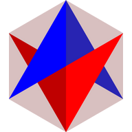
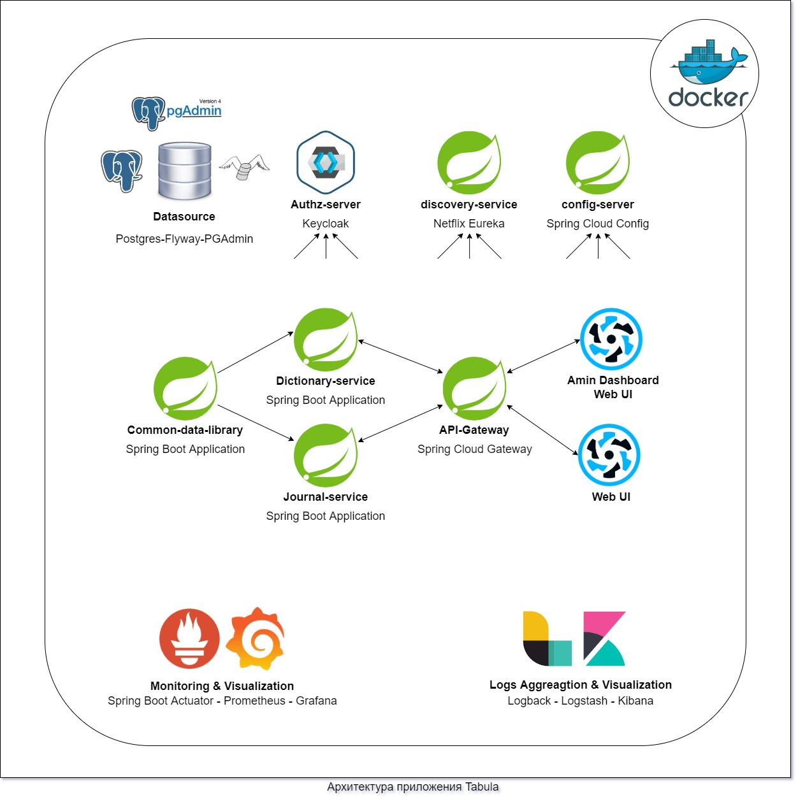

# Tabula 
> Sane Occultist's Assistent

### Описание сути и задач приложения Tabula
Tabula предлставляет собой кросплатформенное приложение, основная задача которого состоит в том, чтобы помочь человеку, ведущему оккультные исследования, автоматизировав все, что может быть автоматизировано в подобного рода деятельности. Tabula - это набор взимоинтергрированных сервисов, а именно:

**Словари** - сервис для предоставления справочной информации. Сюда входят таблицы сответствий, а так же словарь гематрий Еврейских, Греческих Латинских и Енохианских слов и выражений. Сервис подразумевает детальное описание для каждого элемента, а так же изображения там, где они уместны. Источником данных для этого сервиса служат классические произведения оккультной литературы, среди которых "777" Алистера Кроули, Енохианский словарь Лейкока и т.д. Основные возможности этого сервиса:
- Быстрый поиск интересующего понятия или же соответствия.
- Получение списка всех соответствий для выбранного пути Древа Жизни.
- Быстрый поиск гематрий для требуемого числа.
- Возможность рассширять словарь гематрий собственными публичными или же приватными записями.

**Журнал** - сервис для ведения хроники исследований, так называемый "магический дневник". В сравнении с рукописным дневником, или же дневником, который ведется оффлайн на компьютере или в смартфоне, этот сервис предоставляет децентрализованную работу со своими записями откуда угодно - будь то вагон метро, когда можно моментально зафиксировать пришедшую в голову мысль или же описать только что произошедшее событие, или же кабинет дома, где сидя в кресле за компьютером, можно спокойно и комфортно проанализировать данные или сформировать отчет о проведенном эксперименте. Основные возможности этого сервиса:
- Удобное ведение "магического дневника" в электронной форме.
- Доступ к своему дневнику из любого места, где есть выход интернет.
- Синхронизация и децентрализованное хранение записей.
- Удобное создание своей программы тренировок как из предлагаемых класических практик, так и на основание собственных. 

### Архитектура приложения

- Децентрализованный журнал эзотерической практики.
- Full-featured: Real-time Preview, Image (cross-domain) upload, Preformatted text/Code blocks/Tables insert, Code fold, Search replace, Read only, Themes, Multi-languages, L18n, HTML entities, Code syntax highlighting...;
- Markdown Extras : Support ToC (Table of Contents), Emoji, Task lists, @Links...;
- Compatible with all major browsers (IE8+), compatible Zepto.js and iPad;
- Support identification, interpretation, fliter of the HTML tags;
- Support TeX (LaTeX expressions, Based on KaTeX), Flowchart and Sequence Diagram of Markdown extended syntax;
- Support AMD/CMD (Require.js & Sea.js) Module Loader, and Custom/define editor plugins;
