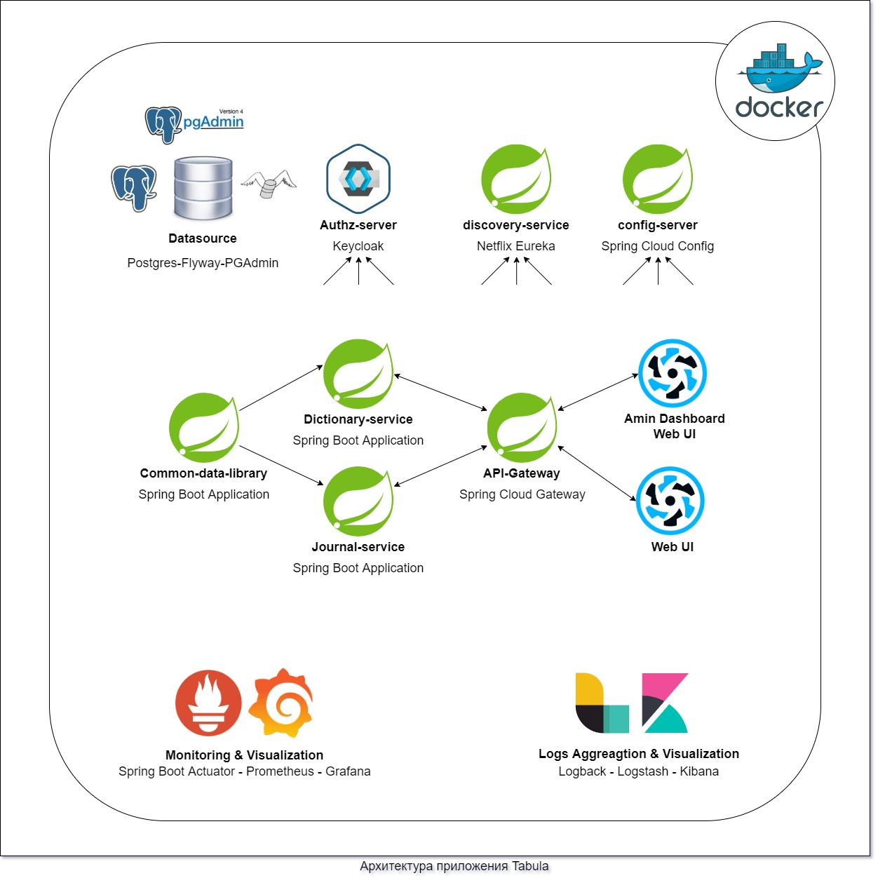
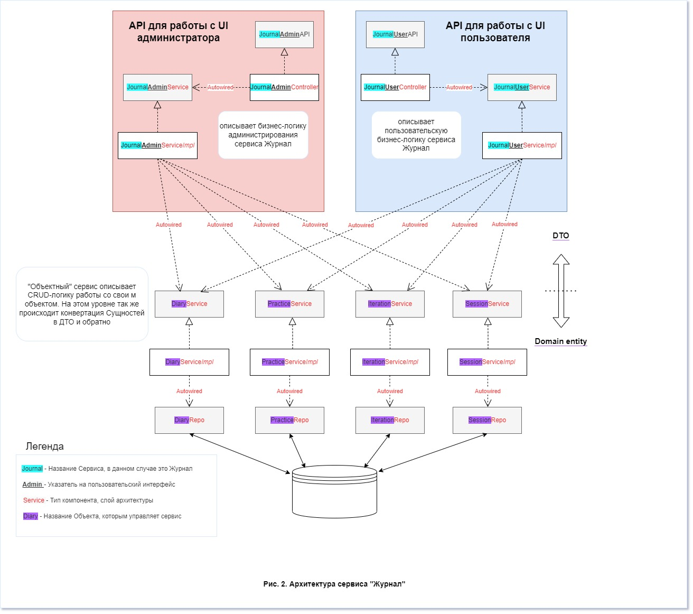

# Tabula 
> Sane Occultist's Assistent

### 1. Описание сути и задач приложения Tabula
Tabula предлставляет собой кросплатформенное приложение, основная задача которого состоит в том, чтобы помочь человеку, ведущему оккультные исследования, автоматизировав все, что может быть автоматизировано в подобного рода деятельности. Tabula - это набор взимоинтергрированных сервисов, а именно:

**Словари** - _Dictionary_ - сервис для предоставления справочной информации. Сюда входят таблицы сответствий, а так же словарь гематрий Еврейских, Греческих Латинских и Енохианских слов и выражений. Сервис подразумевает детальное описание для каждого элемента, а так же изображения там, где они уместны. Источником данных для этого сервиса служат классические произведения оккультной литературы, среди которых "777" Алистера Кроули, Енохианский словарь Лейкока и т.д. Основные возможности этого сервиса:
- Быстрый поиск интересующего понятия или же соответствия.
- Получение списка всех соответствий для выбранного пути Древа Жизни.
- Быстрый поиск гематрий для требуемого числа.
- Возможность рассширять словарь гематрий собственными публичными или же приватными записями.

**Журнал** - _Journal_ - сервис для ведения хроники исследований, так называемый "магический дневник". 
В приложении этот дневник представлен как непрерывная последовательность ежедневных отчетов, каждый из которых, в свою очередь, 
представляет собой совокупность двух объевтов: записи в дневник о события дня, мыслях и чувствах и т.п. и списка олтчетов о проделанных за день практиках. 
(Все эти объекты описаны далее, в п. 2.2.)
В сравнении с рукописным дневником, или же дневником, который ведется оффлайн на компьютере или в смартфоне, этот сервис предоставляет децентрализованную работу со своими записями откуда угодно - будь то вагон метро, когда можно моментально зафиксировать пришедшую в голову мысль или же описать только что произошедшее событие, или же кабинет дома, где сидя в кресле за компьютером, можно спокойно и комфортно проанализировать данные или сформировать отчет о проведенном эксперименте. Основные возможности этого сервиса:
- Удобное ведение "магического дневника" в электронной форме.
- Доступ к своему дневнику из любого места, где есть выход в интернет. (В случае отсутствия связи возможна работа офлайн с последующей синхронизацией)
- Синхронизация и децентрализованное хранение записей.
- Удобное создание своей программы тренировок как из предлагаемых класических практик, так и на основание собственных. 

### 2. Архитектура приложения

#### 2.1 Таблица сервисов приложения

Название сервиса  | Порт
------------- | -------------
ui-admin-dashboard  | 9001
ui-main  | 9000 
api-gateway  | 8080
dictionary-service  | 8082
journal-service  | 8082
keycloack | 8081
pgadmin | 5050
database | 5432
discovery-service | ????
config-server | ????
prometheus | ????
graphana | ????
kibana | ????

#### 2.2 Объекты предметной области
Ниже представлены названия и определения объектов, спецефичных для предметной области приложения. 
Каджый объект приложения имеет обязательные общие поля 
(здесь и далее названия даются в camelCase - так как они представлены в коде. Следует помнить, что названия в базе повторяют названия в коде, по записаны в snake_case):
- id - UUID, уникальный идентификатор объекта в системе.
- author - UUID пользователя, добавившего объект в систему.
- disabled - флаг, указывающий, участвует ли объект в выборках. true - не участвует.
- createdAt - время создания объекта, LocalDateTime.
- updatedAt - время последнего изменения объекта, LocalDateTime. Изначально null.
- createdAt - время удаления объекта, LocalDateTime. Объект, у которого это поле не равно null считается удаленным безвозвратно и больше не участвует в выборках. Изначально null.

Ниже представлены названия и определения объектов, спецефичных для предметной области приложения.

##### Сервис **"Журнал"**
- **Diary** _Запись_ - дневниковая запись. Хранит в себе сам текст дневника в специальном формате xml, позволяющем применять стили, дату записи, а так же указатель на пользователя, которому пренадлежит эта запись.

- **Practice** _Практика_ - Любая исследовательсвая работа и саморазвитие, подразумевает практики, которые ученик тренерует ежедневоно, или с какой-либо иной периоддичностью. 
Духовные практики бывают самыми разнообразными. В контексте приложения практики делятся на в вида: предустановленные, и собственые практики пользователя - видимые только ему.
Предустоновленные практики - это общеизвестные практики, общирно содержащиеся в разноообразной оккультной литературе. Это всевозможные ритуальные техники, медитации, упражнения из йоги, ежедневные поклонения и т.п.
Каждую из этих практик можно отнести к одному из нескольких типов. (см. далее)

- **Iteration** _Итерация_ - Практика практикуется на протяжении определенного времени, например месяца. Затем через еще какое-то время, скажем год, ученик снова решает попрактиковать эту практику, но на этот раз только три недели. 
Таки образом создается две итерации данной практики: Итерация №1 протяженностью в один месяц и Итерация №2 протяженостью три 
недели. У каждой итерации есть дата начала, т.е. день, когда практик впервые приступает к выполнению  данной практики, и дата окончания, когда он делает упраженение в последний раз. 
Так же собственно у итерации есть ссылка на практикующего пользователя. Кроме того, одна практика подразумевает выполнение несколько раз в день, другая - выполнение непрерывно в течении дня, а третья выполняется лишь раз в несколько дней. И все это должно быть учтено при создании итерации.
 
- **Session** _Сессия_ - Единоразовое выполнение практики.

###### 2.2.1 Типы практик
Типы практик и, следовательно, сессий нужны для того, чтобы понять, в каком виде отображать форму для заполнения пользователем данных о проделанной работе в рамках сессии. 
Например, ежедневная практика упражнения под названием "Физическое ясновидение", описанного Кроули в книге "E" подразумевает заполнение специфической таблицы. 
Или например практика МПР предполагает просто запись об условиях, ходе и результате пректики, и т.п. 
Ниже приведен список типов с их описанием: 

    - BASIC_EXERCISE - Базовый тип практики. Подходит для большинства ритуальных техник и медитационых упражнений.
    - BASIC_EXERCISE_COUNT  - Тоже, что и базовый тип, но с добавлением счетчика. Удобно если практика подразумевает подсчет, например, отвлечений.
    - READING - Чтение литературы как разновидность практики.
    - ADORATION_FLO - Спицифический тип для Практики поклонений, описанной в учебном курсе _FLO Threshold_.
    - ADORATION_RESH - Спицифический тип для Практики поклонений, описанной в _Liber Resh vel Helios_.
    - JUGORUM - Спицифический тип для Практики, описанной в _Liber Jugorum_.
    - PRANAYAMA - Спицифический тип для Практики Пранаямы.
    - PHYSICAL_CLAIRVOYANCE - Спицифический тип для Практики, описанной в _Liber E_.

Большинство типов подразумевают только одну практику, как это видно выше. Это связано с исключительной специфиичностью такой практики.
Типы BASIC_EXERCISE и BASIC_EXERCISE_COUNT, напротив, максимально абстрактны и на основании этих двух типов пользователь может создавать свои собственныепрактики.

Поля объекта ПРАКТИКИА

##### Сервис **"Словари"**

- **Source** _Источник_ - Подразумевается источник данных для словаря. Такими источникам являются например Liber 777 и Liber D Кроули. 
Таким образом, каждое соответствие в таблицах соответствий, каждый комментарий, каждая гематрия - все имеет источник информации.

#### 2.2 Архитектура сервисов
Каждый сервис представляет собой отдельное Spring Boot приложение, выпонлненое в классической стиле: Контроллер-Сервис-Репозиторий. 
На картинке ниже показана архитектура сервиса "Журнал". Сервис "Словари" устроен аналогичным образом.

### 3. Ролевая модель приложения
Название роли  | Описание роли
------------- | -------------
USER | Любой пользователь, зарегистрированный в системе
GHUSER | Досточтимый пользователь; имеет полный доступ к функционалу приложения (доступ ко всем словарям)
MODERATOR  | Имеет доступ к администраторскому интерфейсу, может вносить правки в записи, исправлять ошибки, смотреть статистику.
ADMINISTRATOR  | Полный контроль над приложением, доступ ко всем сервисам (см 2.1), возможность назначать роли пользователям

### 4. Функционал приложения
#### 4.1 Функционал выполняемый приложением автоматически
1. Ежедневно в полночь приложение автоматически завершает прошедший день и подготавливает данные для нового дня:
1.1. Осуществляется проверка, что у всех пользователей существует запись (Diary) за прошедщший день и ни у кого не существует за новый. 
Если у пользователя отсутствует запись за прошедший день, то кидается ворнинг и запись создается зщадним числом. 
Если пользователь имеет запись за наступающий день, то так же кидается ворнинг, но запись не удаляется.
1.2. Для каждого пользователя создается новая запись (Diary) за наступающий день.
1.3. Проверяется что все сессии практик 
##### Сервис **"Журнал"**
##### Сервис **"Словари"**
#### 4.2 Функционал доступный пользователю приложения (USER и GHUSER)
##### Сервис **"Журнал"**
##### Сервис **"Словари"**
#### 4.3 Функционал доступный администратору/модератору приложения
Пользователь с ролью MODERATOR или ADMINISTRATOR имеет доступ к вэб интерфейсу ADMIN-DASHBOARD. Из этого инткрфейса такой пользователь иммет доступ к следующему функционалу
##### Сервис **"Журнал"**
##### Сервис **"Словари"**
#### 4.4 Функционал доступный администратору приложения
Адмиинистратор - это супервользователь. Он имеет аполный контроль над данными приложения и обладает доступам ко всем служебным сервисам, а именно:
- GitHub
- PgAdmin
- Keycloak
- Eureka
- Prometheus
- Graphana
- Kibana
- Swagger UI
- Jenkins
- OpenShift
